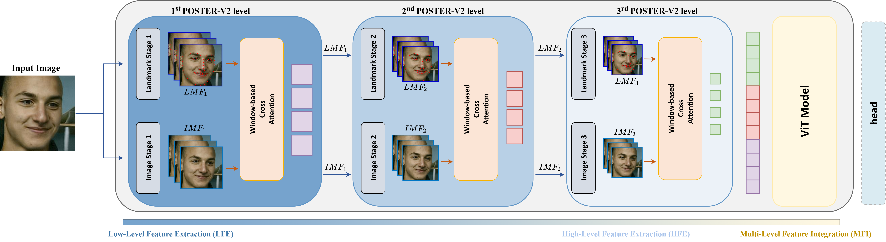

# POSTER V2: A simpler and stronger facial expression recognition network 

[](https://paperswithcode.com/sota/facial-expression-recognition-on-affectnet?p=poster-v2-a-simpler-and-stronger-facial)
[](https://paperswithcode.com/sota/facial-expression-recognition-on-raf-db?p=poster-v2-a-simpler-and-stronger-facial)


Facial expression recognition (FER) plays an important role in a variety of real-world applications such as human-computer interaction. 
POSTER V1 achieves the state-of-the-art (SOTA) performance in FER by effectively combining facial landmark and image features through two-stream pyramid cross-fusion design. 
However, the architecture of POSTER V1 is undoubtedly complex. It causes expensive computational costs. 
In order to relieve the computational pressure of POSTER V1, in this paper, we propose POSTER V2. 
It improves POSTER V1 in three directions: cross-fusion, two-stream, and multi-scale feature extraction. 
In cross-fusion, we use window-based cross-attention mechanism replacing vanilla cross-attention mechanism. 
We remove the image-to-landmark branch in the two-stream design. 
For multi-scale feature extraction, POSTER V2 combines images with landmark's multi-scale features to replace POSTER V1's pyramid design. 
Extensive experiments on several standard datasets show that our POSTER V2 achieves the SOTA FER performance with the minimum computational cost. 
For example, POSTER V2 reached 92.21% on RAF-DB, 67.49% on AffectNet (7 cls) and 63.77% on AffectNet (8 cls), respectively, using only 8.4G floating point operations (FLOPs) and 43.7M parameters (Param). 
This demonstrates the effectiveness of our improvements. 
### Preparation
- Preparing Data

  Download the val dataset from [baidu disk](https://pan.baidu.com/s/1OF6ldYQXpCaAyj9WyTF5Mg?pwd=POST).
  
  As an example, assume we wish to run RAF-DB. We need to make sure it have a structure like following:

	```
	- data/raf-db/
		 train/
		     train_00001_aligned.jpg
		     train_00002_aligned.jpg
		     ...
		 valid/
		     test_0001_aligned.jpg
		     test_0002_aligned.jpg
		     ...
	```

- Preparing Pretrained Models
  
	The following table provides the pre-trained checkpoints used in this paper. Put entire `pretrain` folder under `models` folder.

	<table><tbody>
	<!-- START TABLE -->
	<!-- TABLE HEADER -->
	<th valign="bottom">pre-trained checkpoint</th>
	<th valign="bottom">baidu disk</th>
	<th valign="bottom">codes</th>
	<th valign="bottom">google drive</th>
	<!-- TABLE BODY -->
	<tr><td align="left">ir50</td>
	<td align="center"><a href="https://pan.baidu.com/s/131P9WRQfppUtsrXv8M9RQg">download</a></td>
	<th valign="bottom">(POST)</th>
  	<td align="center"><a href="https://drive.google.com/file/d/17QAIPlpZUwkQzOTNiu-gUFLTqAxS-qHt/view?usp=sharing">download</a></td>
	</tr>
	<tr><td align="left">mobilefacenet</td>
	<td align="center"><a href="https://pan.baidu.com/s/1UPO8nYkr77AsJpMkyrt2ig">download</a></td>
	<th valign="bottom">(POST)</th>
  	<td align="center"><a href="https://drive.google.com/file/d/1SMYP5NDkmDE3eLlciN7Z4px-bvFEuHEX/view?usp=sharing">download</a></td>
	</tbody></table>

### Checkpoints
The following table provides POSTER V2 checkpoints in each dataset.

<table><tbody>
<!-- START TABLE -->
<!-- TABLE HEADER -->
<th valign="bottom">dataset</th>
<th valign="bottom">top-1 acc</th>
<th valign="bottom">baidu disk</th>
<th valign="bottom">codes</th>
<th valign="bottom">google drive</th>
<!-- TABLE BODY -->
<tr><td align="left">RAF-DB</td>
<th valign="bottom">92.21</th>
<td align="center"><a href="https://pan.baidu.com/s/1jYmrHpwoX9zAvWf3CrdIpQ">download</a></td>
<th valign="bottom">(POST)</th>
<td align="center"><a href="https://drive.google.com/file/d/1aVm_hmJyZ5E_0p25XTbm3X9ophsKqCxv/view?usp=sharing">download</a></td>
<tr><td align="left">AffectNet (7 cls)</td>
<th valign="bottom">67.49</th>
<td align="center"><a href="https://pan.baidu.com/s/1fRVaiHekZxJHgPSMB5FyLA">download</a></td>
<th valign="bottom">(POST)</th>
<td align="center"><a href="https://drive.google.com/file/d/1c_gp5UdlcMjIB2dZtdhXFfHOQg1OqU-D/view?usp=sharing">download</a></td>
<tr><td align="left">AffectNet (8 cls)</td>
<th valign="bottom">63.77</th>
<td align="center"><a href="https://pan.baidu.com/s/1J9ijbVp1qr74EF1yvW6Umg">download</a></td>
<th valign="bottom">(POST)</th>
<td align="center"><a href="https://drive.google.com/file/d/1tdYH12vgWnIWfupuBkP3jmWS0pJtDxvh/view?usp=sharing">download</a></td>
<tr><td align="left">CAER-S</td>
<th valign="bottom">93.00</th>
<td align="center"><a href="https://pan.baidu.com/s/1-iT1gLEN-5YrYRB0-V0e6w">download</a></td>
<th valign="bottom">(POST)</th>
<td align="center"><a href="https://drive.google.com/file/d/1Q7RDJxVPTkDH2rlhiAiOpSbIo1wUOqPv/view?usp=sharing">download</a></td>
</tbody></table>


### Test

You can evaluate our model on RAF-DB, AffectNet (7 cls) or CAER-S dataset by running:

```
python main.py --data path/to/dataset --evaluate path/to/checkpoint
```

You can evaluate our model on AffectNet (8 cls) dataset by running:
```
python main_8.py --data path/to/dataset --evaluate path/to/checkpoint
```

### Train
You can train POSTER V2 on RAF-DB dataset by running as follows:
```
python main.py --data path/to/raf-db/dataset --data_type RAF-DB --lr 3.5e-5 --batch-size 144 --epochs 200 --gpu 0
```
You can train POSTER V2 on AffectNet (7 cls) dataset by running as follows:
```
python main.py --data path/to/affectnet-7/dataset --data_type AffectNet-7 --lr 1e-6 --batch-size 144 --epochs 200 --gpu 0
```
You can train POSTER V2 on CAER-S dataset by running as follows:
```
python main.py --data path/to/caer-s/dataset --data_type CAER-S --lr 4e-5 --batch-size 144 --epochs 200 --gpu 0
```
You can train POSTER V2 on AffectNet (8 cls) dataset by running as follows:
```
python main_8.py --data path/to/affectnet-7/dataset --lr 1e-6 --batch-size 144 --epochs 200 --gpu 0
```
You can continue your training by running:
```
python main.py --data path/to/dataset --resume checkpoint/to/continue
```


## License

Our research code is released under the MIT license. See [LICENSE](LICENSE) for details. 


## Acknowledgments

This work was supported by Public-welfare Technology Application Research of Zhejiang Province in China under Grant LGG22F020032, and Key Research and Development Project of Zhejiang Province in China under Grant 2021C03137.

Our implementation and experiments are built on top of open-source GitHub repositories. We thank all the authors who made their code public, which tremendously accelerates our project progress. If you find these works helpful, please consider citing them as well.

[JiaweiShiCV/Amend-Representation-Module](https://github.com/JiaweiShiCV/Amend-Representation-Module) 

## Citation

If you use this code for your research, please cite our paper POSTER V2: A simpler and stronger facial expression recognition network:

```
@article{mao2023poster,
  title={POSTER V2: A simpler and stronger facial expression recognition network},
  author={Mao, Jiawei and Xu, Rui and Yin, Xuesong and Chang, Yuanqi and Nie, Binling and Huang, Aibin},
  journal={arXiv preprint arXiv:2301.12149},
  year={2023}
}
```
